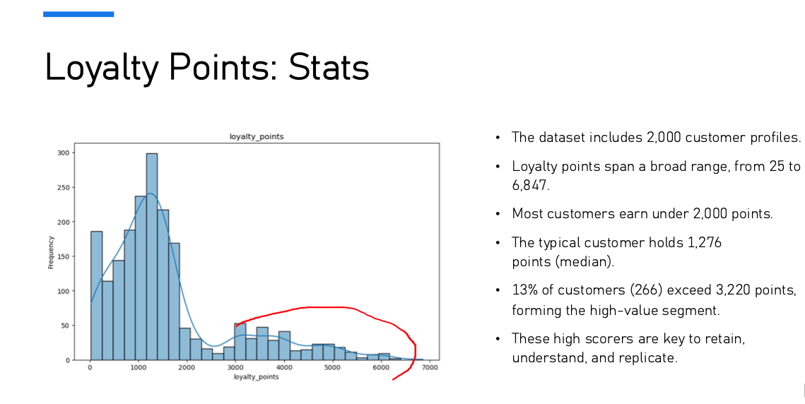
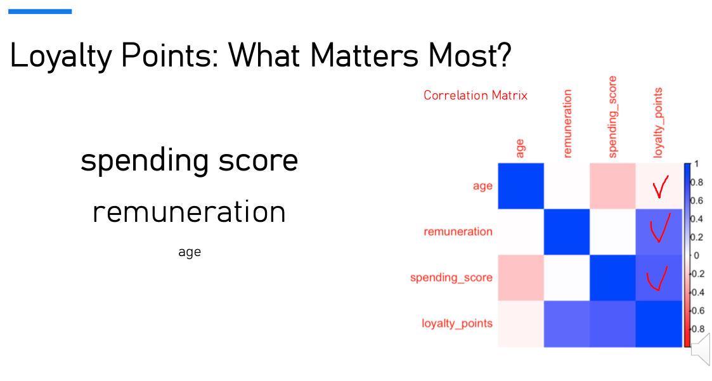
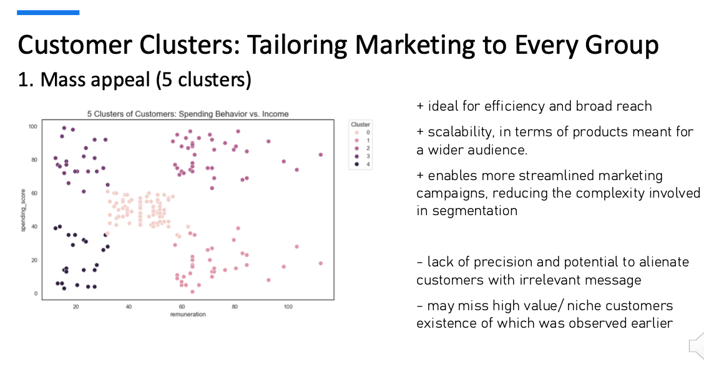
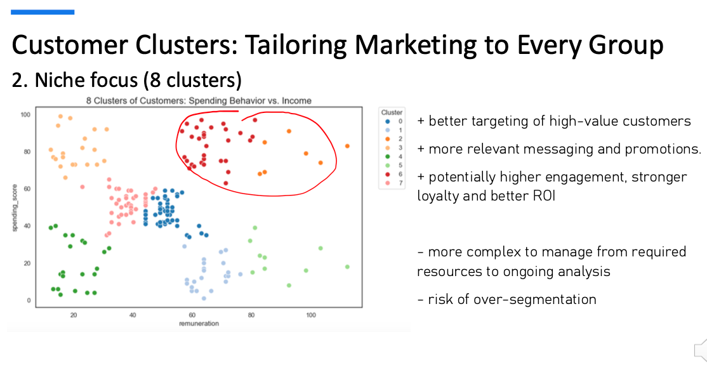
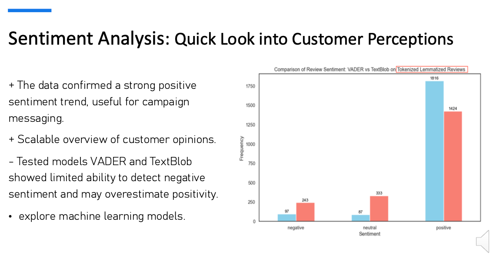

# TurtleGames

**Tools used**: Python (Pandas, Numpy, Matplotlib, Seaborn, Scipy, Statsmodels, and Scikit-learn, TextBlob, VADER), R (Tidyverse, Plyr, ggplot2)

**Topics** Linear Regression, Multiple Linear Regression, K-means Clustering, Decission Tree Regressor, Natural Language Processing, Sentiment Analysis.

📂 [Presentation Slides](Cepure_Jurgita_DA301_Assignment_Presentation_slides.pdf)
📂 [Technical Report](Cepure_Jurgita_DA301_Assignment_Report.pdf)
📂 [Python Code Notebook](Cepure_Jurgita_DA301_Assignment_Notebook.ipynb)
📂 [R Script](Cepure_Jurgita_DA301_Assignment_Rscript.R)
📂 [Feedback](Jurgita%20Cepure%20Assignment%203%20Feedback.pdf)

----------------------

## ❓ Business Questions: 

To improve sales performance, Turtle Games has posed set of questions: 
- How do customers engage with and accumulate loyalty points?
- How can customers be segmented into groups for targeted marketing?
- How can customer reviews be used to inform marketing campaigns and make improvements to the business?
- Are loyalty points suitable data to create predictive models?

----------------------

## 🫚 Data Source
The file *turtle_reviews.csv* was used in the analysis. It contained limited customer information—such as age, education level, income, and loyalty points—as well as product identifiers and corresponding customer reviews.

----------------------

## ⚙️ Analytical Approach 

- To **investigate which factors influence loyalty points accumulation** through
a multi-method analysis: MLR and Decision Tree Regressor were applied in Python, with key
findings cross-validated in R, the company’s preferred language.

- **Customer segmentation** was performed using K-Means clustering to support targeted marketing.

- Basic text preprocessing and lexicon-based sentiment models (VADER, TextBlob) were applied to customer reviews to
demonstrate **the potential of leveraging sentiment insights for better decision-making**.

----------------------

## 📊 Patterns, Trends, and Insights

